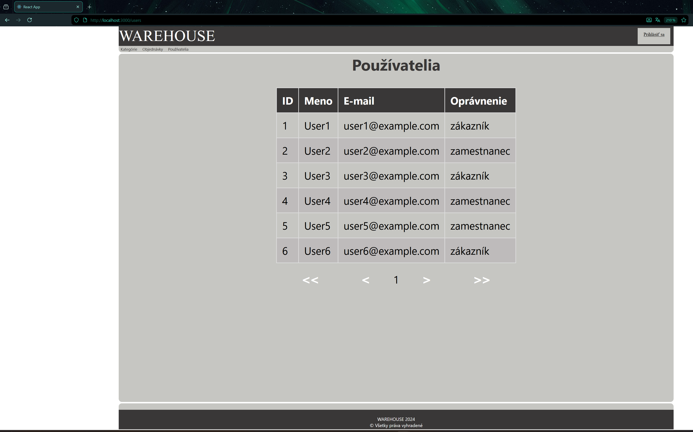
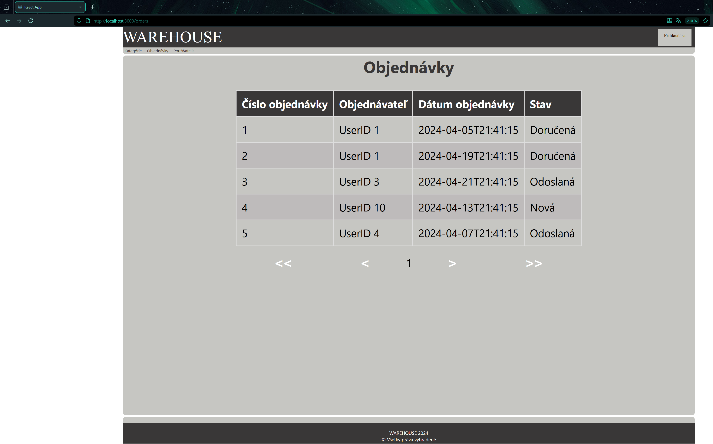
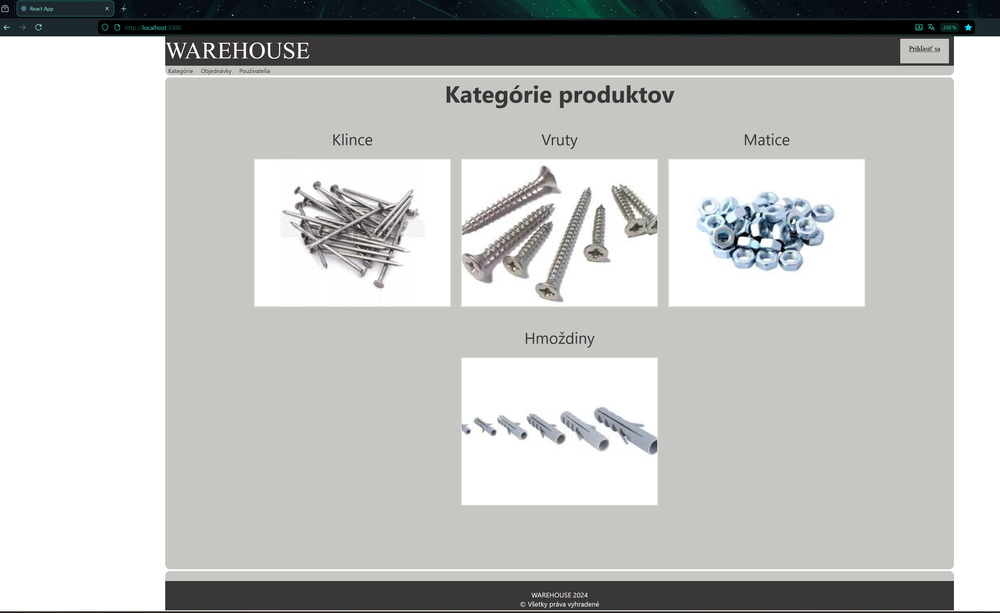
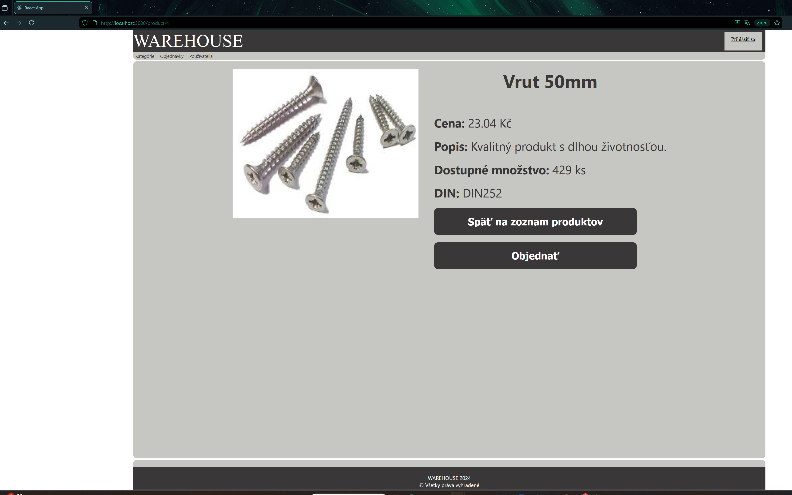

#  Warehouse API

Backend REST API for a simple warehouse / e-commerce system built with **ASP.NET Core**.

The application provides endpoints for managing products, categories, users and orders,
including authentication using **JWT tokens**. The project demonstrates basic backend 
development concepts such as REST API design, database interaction and authentication.
It also provides front end by SPA developed in React+VUE.

---

##  Features

-  User registration and login
-  JWT authentication
-  Product management
-  Category management
-  Order management
-  Order item management
-  REST API architecture
-  Database access using **Dapper ORM**

---

##  Technologies
-  **ASP.NET Core Web API**
-  **Dapper ORM**
-  **SQL Server**
-  **JWT Authentication**
-  **Swagger / OpenAPI**

---

##  Project Structure
```
Controllers/ - REST API endpoints
Data/ - database access using Dapper
Dtos/ - data transfer objects used for API communication
Models/ - database entity models
Helpers/ - authentication helper (passsword hashing, JWT token generation)
wwwroot/ - static files and frontend build
my-spa/ - frontend single-page application

Program.cs - application startup and middleware configuration
```
---

##  API Modules

-  **AuthController** - authentication (register, login, refresh token)
-  **ProductController** - product management
-  **CategoryController** - category management
-  **OrderController** - order management
-  **OrderItemController** - order item management
-  **UserController** - user management

---


##  Application Preview

###  Users Management



###  Orders



###  Categories



###  Product detail



---

##  Purpose

This project demonstrates backend development using ASP.NET Core, including REST API design,
authentication and database integration.


